<!-- markdownlint-disable MD022 MD024 MD032 MD033 -->
# Code Notes

<!-- [](assets/images/udacity-react.jpg) -->

This site contains code notes for project 1 of my Udacity React Nanodegree project. Click the link below for more information on the course.
- [Udacity's React Nanodegree Program](https://www.udacity.com/course/react-nanodegree--nd019)

---

## 1. Setup
### 1.1 Create React App
The first thing I did was start with a fresh [Create React App](https://facebook.github.io/create-react-app/) instance.

```bash
npx create-react-app reactnd-project-myreads
cd reactnd-project-myreads
npm start
```

The last command tests that the app installed properly.

### 1.2 Add Starter Files
This step consisted of copying the [starter site files to the repo](https://github.com/udacity/reactnd-project-myreads-starter).

This includes:

- /INSTRUCTIONS.md
- /SEARCH_TERMS.md
  - /src/App.css
  - /src/App.js
  - /src/BooksAPI.js
  - /src/index.css
  - /src/index.js

### 1.3 Setup Jekyll
The Jekyll static site generator allows me to document the steps I take to build this project.

Jekyll is what GitHub uses to generate GitHub Pages. Creating a local copy allows previews  of these docs locally before pushing to GitHub.

## 2. Analysis
### 2.1 What it Does
The My Reads App allows you to track books and place them on one of three bookshelves.

[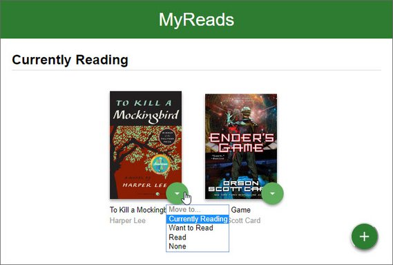](assets/images/p1.jpg)<br>
**Live Demo:** [reactnd-project-myreads@1-starter-files](https://codesandbox.io/s/github/james-priest/reactnd-project-myreads/tree/1-starter-files/) on CodeSandbox

Each shelf corresponds to one of the following

- Currently Reading
- Want to Read
- Have Read

The app also lets you search for books and add them to one of the three category shelves.

Lastly the app allows you to move books between shelves.

### 2.2 Code Process
#### Roadmap
Below a link to the roadmap I follow for taking a mock-up or static site and building a full fledged React application from it.

- [12. Thinking in React](https://reactjs.org/docs/thinking-in-react.html)

That page is part of the [Twelve Main Concepts of React](https://reactjs.org/docs/hello-world.html)  outlined by [Dan Abramov](https://twitter.com/dan_abramov), one of the dev evangelists of the UI library.

#### Approach
Additionally, I've found the easiest way to work on small projects is to keep all the components on one page to start. This way I don't have to worry about the plumbing of connecting multiple pages.

I also tend to work from the top down which is what is recommended for smaller projects.

Once I get to the lowest component in a hierarchy I then start to split the components into their own files.

### 2.3 Split UI into Hierarchy
The first step was to look at the UI and determine each of the logical areas.

I then drew boxes around each of these areas and broke it down according to function.

[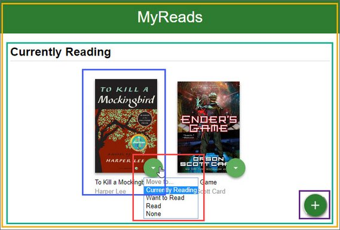](assets/images/p2.jpg)

This became my hierarchy of components. The components are split between two pages - a List page and a Search page.

Here's the nested representation.

- App (yellow)
  - List Books page
    - Bookshelf (green)
      - Book (blue)
        - Bookshelf Changer (red)
    - Add Book Button (purple)
  - Search Books page
    - Close Search Button (green)
    - Search Bar (purple)
    - Search Results (blue)
      - Book (yellow)
        - Bookshelf Changer (red)

[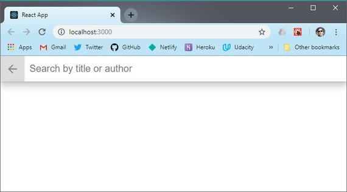](assets/images/p3.jpg)

## 3. Routing
### 3.1 Install React Router
I installed the React Router package.

```bash
npm install --save react-router-dom
```

### 3.2 Add BrowserRouter
Next I imported the BrowserRouter component into index.js and wrapped `<App />` with it.

```jsx
// index.js
import React from 'react';
import ReactDOM from 'react-dom';
import { BrowserRouter } from 'react-router-dom';
import App from './App';
import './index.css';

ReactDOM.render(
  <BrowserRouter>
    <App />
  </BrowserRouter>,
  document.getElementById('root')
);
```

### 3.3 Add Route & Link
Next I imported Route and Link components into App.js.

```jsx
// App.js
import React, { Component } from 'react';
import { Route, Link } from 'react-router-dom';
```

### 3.4 Convert State to Route
This is the part where we move away from using state to determine which component to display and instead use React Router.

The old code used something like this.

```jsx
// App.js
class BooksApp extends Component {
  state = {
    showSearchPage: false,
  };
  render() {
    return (
      <div className="app">
        {this.state.showSearchPage ? (
          // <div className="search-books">
            // button onClick={() => this.setState({ showSearchPage: false })
        ) : (
          // <div className="list-books">
            // button onClick={() => this.setState({ showSearchPage: true })}
        )}
      </div>
    )
  }
}
```

The updated code now uses Route and Link. I also split out the code into it's own List and Search components.

```jsx
// App.js
class BooksApp extends Component {
  state = {};
  render() {
    return (
      <div className="app">
        <Route exact path="/" component={BookList} />
        <Route path="/search" component={BookSearch} />
      </div>
    )
  }
}

class BookList extends Component {
  render() {
    return (
      <div className="list-books">
        {/* UI code */}
      </div>
    )
  }
}

class BookSearch extends Component {
  render() {
    return (
      <div className="search-books">
        {/* UI code */}
      </div>
    )
  }
}
```

**Live Demo:** [reactnd-project-myreads@2-routing](https://codesandbox.io/s/github/james-priest/reactnd-project-myreads/tree/2-routing/) on CodeSandbox

## 4. Components
### 4.1 Split UI Components
[The React docs recommend](https://reactjs.org/docs/thinking-in-react.html#step-2-build-a-static-version-in-react) that once the UI/component hierarchy is determined you should build out a static version in React.

This version should take the data model and render the UI without any interactivity yet - meaning we should split out each component in its hierarchy and pass data using **props** but not implement any **state** since **state is reserved for interactivity**.

This image shows roughly how were going to organize the code. Currently all code is in App.js and will remain in one file while I split up the UI.

[](assets/images/p2.jpg)<br>
**Live Demo:** [reactnd-project-myreads@3-split-components](https://codesandbox.io/s/github/james-priest/reactnd-project-myreads/tree/3-split-components/) on CodeSandbox

Here's how I split up the code starting with the home page.

```jsx
// App.js
class BooksApp extends Component {
  render() {
    return (
      <div className="app">
        <Route exact path="/" component={BookList} />
        <Route path="/search" component={BookSearch} />
      </div>
    );
  }
}

class ListBooks extends Component {
  render() {
    const { bookshelves } = this.props;
    return (
      <div className="list-books">
        <div className="list-books-title">
          <h1>MyReads</h1>
        </div>
        <Bookcase bookshelves={bookshelves} />
        <OpenSearchButton />
      </div>
    );
  }
}

const OpenSearchButton = () => {
  return (
    <div className="open-search">
      <Link to="search">
        <button>Add a Book</button>
      </Link>
    </div>
  );
};

const Bookcase = props => {
  const { bookshelves } = props;
  return (
    <div className="list-books-content">
      <div>
        {bookshelves.map(shelf => (
          <Bookshelf key={shelf.key} shelf={shelf} />
        ))}
      </div>
    </div>
  );
};

const Bookshelf = props => {
  const { shelf } = props;
  return (
    <div className="bookshelf">
      <h2 className="bookshelf-title">{shelf.name}</h2>
      <div className="bookshelf-books">
        <ol className="books-grid">
          <Book book={{}} />
        </ol>
      </div>
    </div>
  );
};

const Book = props => {
  const { book } = props;
  return (
    <li>
      <div className="book">
        <div className="book-top">
          <div
            className="book-cover"
            style={{
              width: 128,
              height: 193,
              backgroundImage:
                'url("http://books.google.com/books/content?id=PGR2Aw...")',
            }}
          />
          <BookshelfChanger />
        </div>
        <div className="book-title">To Kill a Mockingbird</div>
        <div className="book-authors">Harper Lee</div>
      </div>
    </li>
  );
};

class BookshelfChanger extends Component {
  render() {
    return (
      <div className="book-shelf-changer">
        <select>
          <option value="move" disabled>
            Move to...
          </option>
          <option value="currentlyReading">Currently Reading</option>
          <option value="wantToRead">Want to Read</option>
          <option value="read">Read</option>
          <option value="none">None</option>
        </select>
      </div>
    );
  }
}
```

Below is a picture of roughly how were going to break out the Search page components.

[](assets/images/p3.jpg)<br>
**Live Demo:** [reactnd-project-myreads@3-split-components](https://codesandbox.io/s/github/james-priest/reactnd-project-myreads/tree/3-split-components/) on CodeSandbox

I separated the code into a couple more components than the image shows.

```jsx
// App.js
class BookSearch extends Component {
  render() {
    return (
      <div className="search-books">
        <SearchBar />
        <SearchResults />
      </div>
    );
  }
}

const SearchBar = props => {
  return (
    <div className="search-books-bar">
      <CloseSearchButton />
      <SearchBooksInput />
    </div>
  );
};

const CloseSearchButton = () => {
  return (
    <Link to="/">
      <button className="close-search">Close</button>
    </Link>
  );
};

class SearchBooksInput extends Component {
  render() {
    return (
      <div className="search-books-input-wrapper">
        <input type="text" placeholder="Search by title or author" />
      </div>
    );
  }
}

const SearchResults = props => {
  return (
    <div className="search-books-results">
      <ol className="books-grid">
        <Book />
      </ol>
    </div>
  );
};
```

As I started to breakdown the UI into separate components it began to differ a bit from what I outlined in the previous section. This is because I got a better clarity of how the components should be nested as I was splitting up the code.

So far we have this hierarchy.

- BooksApp
  - Route {ListBooks}
    - Bookcase
      - Bookshelf
        - Book
          - BookshelfChanger
    - OpenSearchButton
  - Route {SearchBooks}
    - SearchBar
      - CloseSearchButton
      - SearchBooksInput
    - SearchResults
      - Book
        - BookshelfChanger

The next step will be to bring the data in and start to pass that down as props.

### 4.2 Create Static Data
The next thing I did was to bring the data into the app as static data which I assigned to state. This is so I can start passing props to child components.

I first started by doing an 'getAll' Ajax request using Postman.

[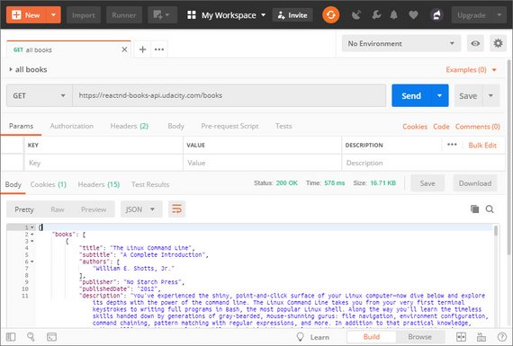](assets/images/p4.jpg)

This returned the data that defines which books show up on each shelf within the MyReads app. It returned the data in this format.
<!-- cSpell:disable -->

```json
{
  "books": [
    {
      "title": "Learning Web Development with React and Bootstrap",
      "authors": [
        "Harmeet Singh",
        "Mehul Bhatt"
      ],
      "publishedDate": "2016-12-30",
      "description": "Build real-time responsive web apps using React and...",
      "industryIdentifiers": [
        {
          "type": "ISBN_10",
          "identifier": "1786462494"
        },
        {
          "type": "ISBN_13",
          "identifier": "9781786462497"
        }
      ],
      "readingModes": {
        "text": false,
        "image": false
      },
      "pageCount": 278,
      "printType": "BOOK",
      "maturityRating": "NOT_MATURE",
      "allowAnonLogging": false,
      "contentVersion": "preview-1.0.0",
      "panelizationSummary": {
        "containsEpubBubbles": false,
        "containsImageBubbles": false
      },
      "imageLinks": {
        "smallThumbnail": "http://books.google.com/books/content?",
        "thumbnail": "http://books.google.com/books/content?"
      },
      "language": "en",
      "previewLink": "http://books.google.com/books?id=sJf1vQAACAAJ&dq=redux",
      "infoLink": "http://books.google.com/books?id=sJf1vQAACAAJ&dq=redux",
      "canonicalVolumeLink": "https://books.google.com/books/about/Learning",
      "id": "sJf1vQAACAAJ",
      "shelf": "currentlyReading"
    },
    {
      "title": "another book"
    }
  ]
}
```

<!-- cSpell:enable -->
I then created data.js to hold the books data and export a `getAll` method.

```js
// data.js
const getAll = [
  {
    title: 'The Linux Command Line',
    subtitle: 'A Complete Introduction',
    // more data...
  },
  {
    title: 'The React Handbook',
    subtitle: 'Learning to Build Dynamic UIs',
    // more data...
  },
  // next book...
];

export default getAll;
```

I imported data.js into App.js and assigned it to the `state` property for our BooksApp component. At the same time I created a `bookshelves` constant to use with my Bookcase component.

```jsx
// App.js
// other import statements...
import getAll from './data';

class BooksApp extends Component {
  bookshelves = [
    { key: 'currentlyReading', name: 'Currently Reading' },
    { key: 'wantToRead', name: 'Want to Read' },
    { key: 'read', name: 'Have Read' },
  ];

  state = {
    books: getAll,
  };

```

Now all of our books are available as a `books` property of our BooksApp state.

### 4.3 Introduce Props
Now is the time to use props to pass the data down the hierarchy.

Here are the changes for the List Books page.

```jsx
// App.js
class BooksApp extends Component 
  bookshelves = [
    { key: 'currentlyReading', name: 'Currently Reading' },
    { key: 'wantToRead', name: 'Want to Read' },
    { key: 'read', name: 'Have Read' },
  ];

  state = {
    books: getAll,
  };

  render() {
    const { books } = this.state;
    return (
      <div className="app">
        <Route
          exact
          path="/"
          render={() => (
            <ListBooks bookshelves={this.bookshelves} books={books} />
          )}
        />
        <Route path="/search" render={() => <SearchBooks books={books} />} />
      </div>
    );
  }
}

class ListBooks extends Component {
  render() {
    const { bookshelves, books } = this.props;
    return (
      <div className="list-books">
        <div className="list-books-title">
          <h1>MyReads</h1>
        </div>
        <Bookcase bookshelves={bookshelves} books={books} />
        <OpenSearchButton />
      </div>
    );
  }
}

const Bookcase = props => {
  const { bookshelves, books } = props;
  return (
    <div className="list-books-content">
      <div>
        {bookshelves.map(shelf => (
          <Bookshelf key={shelf.key} shelf={shelf} books={books} />
        ))}
      </div>
    </div>
  );
};

const Bookshelf = props => {
  const { shelf, books } = props;
  const booksOnThisShelf = books.filter(book => book.shelf === shelf.key);
  return (
    <div className="bookshelf">
      <h2 className="bookshelf-title">{shelf.name}</h2>
      <div className="bookshelf-books">
        <ol className="books-grid">
          {booksOnThisShelf.map(book => (
            <Book key={book.id} book={book} shelf={shelf.key} />
          ))}
        </ol>
      </div>
    </div>
  );
};

const Book = props => {
  const { book, shelf } = props;
  return (
    <li>
      <div className="book">
        <div className="book-top">
          <div
            className="book-cover"
            style={{
              width: 128,
              height: 193,
              backgroundImage: `url(${book.imageLinks.thumbnail})`,
            }}
          />
          <BookshelfChanger book={book} shelf={shelf} />
        </div>
        <div className="book-title">{book.title}</div>
        <div className="book-authors">{book.authors.join(', ')}</div>
      </div>
    </li>
  );
};

class BookshelfChanger extends Component {
  render() {
    return (
      <div className="book-shelf-changer">
        <select value={this.props.shelf}>
          <option value="move" disabled>
            Move to...
          </option>
          <option value="currentlyReading">Currently Reading</option>
          <option value="wantToRead">Want to Read</option>
          <option value="read">Read</option>
          <option value="none">None</option>
        </select>
      </div>
    );
  }
}
```

This now has our books showing up on the appropriate bookshelves.

[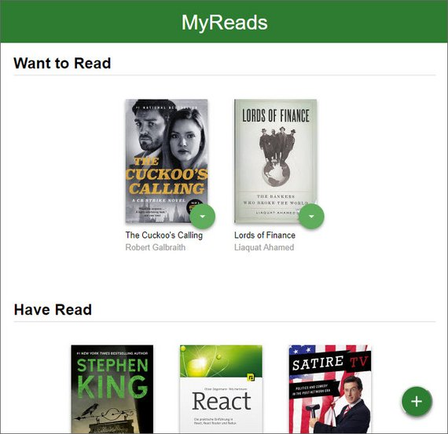](assets/images/p5.jpg)<br>
**Live Demo:** [reactnd-project-myreads@4-add-props](https://codesandbox.io/s/github/james-priest/reactnd-project-myreads/tree/4-add-props/) on CodeSandbox

Here are the components for the Search Books page

```jsx
// App.js
class SearchBooks extends Component 
  render() {
    const { books } = this.props;
    return (
      <div className="search-books">
        <SearchBar />
        <SearchResults books={books} />
      </div>
    );
  }
}

const SearchResults = props => {
  const { books } = props;
  return (
    <div className="search-books-results">
      <ol className="books-grid">
        {books.map(book => (
          <Book key={book.id} book={book} shelf="none" />
        ))}
      </ol>
    </div>
  );
};
```

[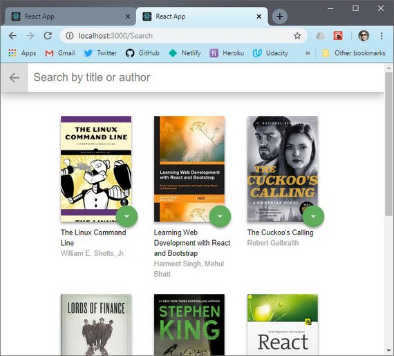](assets/images/p6.jpg)<br>
**Live Demo:** [reactnd-project-myreads@4-add-props](https://codesandbox.io/s/github/james-priest/reactnd-project-myreads/tree/4-add-props/) on CodeSandbox

## 5. Main Page
### 5.1 Move Book to Shelf
Now we create a `moveBook` method which is in charge of moving a book from one bookshelf to another.

It lives at the top of the component stack in BooksApp so that it can access state which we also lifted to live here.

```jsx
// App.js
import getAll from './data';

class BooksApp extends Component {
   bookshelves = [
    { key: 'currentlyReading', name: 'Currently Reading' },
    { key: 'wantToRead', name: 'Want to Read' },
    { key: 'read', name: 'Read' },
  ];
  state = {
    books: getAll
  };
  moveBook = (book, shelf) => {
    const updatedBooks = this.state.books.map(b => {
      if (b.id === book.id) {
        b.shelf = shelf;
      }
      return b;
    });

    this.setState({
      books: updatedBooks,
    });
  };
}

render() {
    const { books } = this.state;
    return (
      <div className="app">
        <Route
          exact
          path="/"
          render={() => (
            <ListBooks
              bookshelves={this.bookshelves}
              books={books}
              onMove={this.moveBook}
            />
          )}
        />
        <Route
          path="/search"
          render={() => (
            <SearchBooks
              books={searchBooks}
              onMove={this.moveBook}
            />
          )}
        />
      </div>
    );
  }
}
```

Next the method needs to be passed down to the BookshelfChanger component. This means it has to go through:

- ListBooks
  - Bookcase
    - Bookshelf
      - Book
        - BookshelfChanger

Here is the ListBooks component showing how `this.props` is destructured and then passed to the next nested component.

```jsx
// App.js
class ListBooks extends Component {
  render() {
    const { bookshelves, books, onMove } = this.props;
    return (
      <div className="list-books">
        <div className="list-books-title">
          <h1>MyReads</h1>
        </div>
        <Bookcase bookshelves={bookshelves} books={books} onMove={onMove} />
        <OpenSearchButton />
      </div>
    );
  }
}
```

This same pattern is followed all the way down to BookshelfChanger. Once there, `onMove` is invoked in the `handleChange` method.

The pattern we see here is that of a [Controlled Component](https://reactjs.org/docs/forms.html?no-cache=1#controlled-components) where React is used to manage the element's state making React the "single source of truth".

We do this by creating a state property to manage the select element's value. We then assign it to the select element's `value` attribute. Lastly, we create an `onChange` method to update state as the value changes.

```jsx
// App.js
class BookshelfChanger extends Component {
  state = {
    value: this.props.shelf,
  };
  handleChange = event => {
    this.setState({ value: event.target.value });
    this.props.onMove(this.props.book, event.target.value);
  };
  render() {
    return (
      <div className="book-shelf-changer">
        <select value={this.state.value} onChange={this.handleChange}>
          <option value="move" disabled>
            Move to...
          </option>
          <option value="currentlyReading">Currently Reading</option>
          <option value="wantToRead">Want to Read</option>
          <option value="read">Read</option>
          <option value="none">None</option>
        </select>
      </div>
    );
  }
}
```

It's in the handleChange method that we invoke the onMove method, passing it the `bookId` and `shelf` the book is being moved to.

One thing to note is that we are using props to set state. Normally this is an anti-pattern because it leads to the data living in two separate places.

In this case we are using props to set an initial value and don't need any changes in props to stay in sync with state.

Here's an excerpt from the old React docs on this.

> *However, it’s not an anti-pattern if you make it clear that the prop is only seed data for the component’s internally-controlled state*

Here's the UI with books that are moved from "Currently Reading" to "Want to Read".

[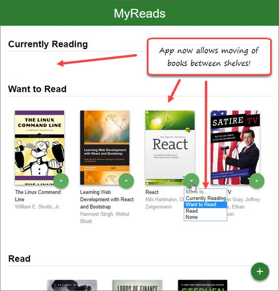](assets/images/p7.jpg)<br>
**Live Demo:** [reactnd-project-myreads@5-add-books-state](https://codesandbox.io/s/github/james-priest/reactnd-project-myreads/tree/5-add-books-state/) on CodeSandbox

### 5.2 Ajax to Get All Books
The next thing I did was to remove the reference to hard-coded data and add an Ajax request to dynamically pull down the books.

This is done in the componentDidMount method of BooksApp.

```jsx
// App.js
// more import...
import * as BooksAPI from './BooksAPI';

class BooksApp extends Component {
  bookshelves = [
    { key: 'currentlyReading', name: 'Currently Reading' },
    { key: 'wantToRead', name: 'Want to Read' },
    { key: 'read', name: 'Read' },
  ];
  state = {
    books: []
  };
  componentDidMount = () => {
    BooksAPI.getAll().then(books => {
      this.setState({ books: books });
    });
  };

  render() {
    // render code...
  }
}
```

### 5.3 Ajax to Update Shelf
Now we need to invoke the Ajax requests that updates the database whenever we move a book to a new shelf.

```jsx
// App.js
class BooksApp extends Component {
  // code...
  moveBook = (book, shelf) => {
    BooksAPI.update(book, shelf).then(books => {
      console.log(books);
    });
    const updatedBooks = this.state.books.map(b => {
      if (b.id === book.id) {
        b.shelf = shelf;
      }
      return b;
    });

    this.setState({
      books: updatedBooks,
    });
  };
  // more code...
```

We test that the data is being updated by capturing the response and logging it out to the console.

This shows the book.id by shelf.

[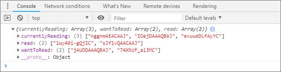](assets/images/p8.jpg)<br>
**Live Demo:** [reactnd-project-myreads@6-add-books-ajax](https://codesandbox.io/s/github/james-priest/reactnd-project-myreads/tree/6-add-books-ajax/) on CodeSandbox

## 6. Search Page
### 6.1 Build Search Input
The Search page is responsible for a few things which are triggered by the Search input. Here are the requirements:

- As the user types into the search field, books that match the query are displayed on the page, along with their titles and authors.
- Throttle/Debounce may be used to limit input and provide a smooth UX.
- Search results are not shown when all of the text is deleted out of the search input box.
- Invalid queries are handled and prior search results are not shown.
- The search works correctly when a book does not have a thumbnail or an author.
- The user is able to search for multiple words, such as "artificial intelligence."

The first thing to do is create a new state property called `searchBooks` which will contain the search results. We'll do this at the top of the hierarchy in BooksApp.

We also create a `searchForBooks` method and a `resetSearch` method. These will be invoked from the SearchBooksInput and CloseSearchButton components.

```jsx
// App.js
class BooksApp extends Component {
  //code...
  state = {
    books: [],
    searchBooks: [],
  };
  // more code...
  searchForBooks = query => {
    if (query.length > 0) {
      BooksAPI.search(query).then(books => {
        if (books.error) {
          this.setState({ searchBooks: [] });
        } else {
          this.setState({ searchBooks: books });
        }
      });
    } else {
      this.setState({ searchBooks: [] });
    }
  };
  resetSearch = () => {
    this.setState({ searchBooks: [] });
  };
```

What the code does is it invokes the Ajax call if the query length is greater than zero otherwise it clears the data. It then sets the state to an empty array if there is no match (error returned). Otherwise state is set with the results.

Below is where we pass the handlers as props within our Search Route.

```jsx
// App.js
class BooksApp extends Component {
  // code...
  render() {
    const { books, searchBooks } = this.state;
    return (
      <div className="app">
        {/* ListBooks Route */}
        <Route
          path="/search"
          render={() => (
            <SearchBooks
              books={searchBooks}
              onSearch={this.searchForBooks}
              onMove={this.moveBook}
              onResetSearch={this.resetSearch}
            />
          )}
        />
      </div>
    );
  }
}
```

Here we show the props being passed through child components on their way to their destination.

```jsx
// App.js
class SearchBooks extends Component {
  render() {
    const { books, onSearch, onResetSearch } = this.props;
    return (
      <div className="search-books">
        <SearchBar onSearch={onSearch} onResetSearch={onResetSearch} />
        <SearchResults books={books} />
      </div>
    );
  }
}
const SearchBar = props => {
  const { onSearch, onResetSearch } = props;
  return (
    <div className="search-books-bar">
      <CloseSearchButton onResetSearch={onResetSearch} />
      <SearchBooksInput onSearch={onSearch} />
    </div>
  );
};
```

Here we invoke the reset handler when the button inside CloseSearchButton component is clicked.

```jsx
// App.js
const CloseSearchButton = props => {
  const { onResetSearch } = props;
  return (
    <Link to="/">
      <button className="close-search" onClick={onResetSearch}>
        Close
      </button>
    </Link>
  );
};
```

Lastly, we set up the search input as a controlled component. We use onChange to update local state and to trigger the onSearch handler (searchForBooks method defined in BooksApp).

```jsx
// App.js
class SearchBooksInput extends Component {
  state = {
    value: '',
  };
  handleChange = event => {
    const val = event.target.value;
    this.setState({ value: val }, () => {
      this.props.onSearch(val);
    });
  };
  render() {
    return (
      <div className="search-books-input-wrapper">
        <input
          type="text"
          value={this.state.value}
          placeholder="Search by title or author"
          onChange={this.handleChange}
          autoFocus
        />
      </div>
    );
  }
}
```

### 6.2 Throttle / Debounce
The next thing we need to do implement throttle / debounce so that the number of Ajax calls are limited to a reasonable number.

Throttle limits the number of calls to once within a certain time period and debounce will wait a certain period of time after the last call to invoke the function.

In our case we need debounce which we'll implement on our searchForBooks method by wrapping the arrow function like this.

First we need to install the library.

```bash
npm install throttle-debounce
```

```jsx
// App.js
import { debounce } from 'throttle-debounce';

class BooksApp extends Component {
  // code...
  searchForBooks = debounce(300, false, query => {
    console.log(query);
    if (query.length > 0) {
      BooksAPI.search(query).then(books => {
        console.log(books);
        if (books.error) {
          this.setState({ searchBooks: [] });
        } else {
          this.setState({ searchBooks: books });
        }
      });
    } else {
      this.setState({ searchBooks: [] });
    }
  });
```

### 6.3 Fix Edge Cases
Next we need to make sure the app handles books which are missing authors or thumbnails.

This can be done with logical && format for backgroundImage and book.authors.

```jsx
// App.js
const Book = props => {
  const { book, shelf, onMove } = props;
  return (
    <li>
      <div className="book">
        <div className="book-top">
          <div
            className="book-cover"
            style={{
              width: 128,
              height: 193,
              backgroundImage: `url(${book.imageLinks &&
                book.imageLinks.thumbnail})`,
            }}
          />
          <BookshelfChanger book={book} shelf={shelf} onMove={onMove} />
        </div>
        <div className="book-title">{book.title}</div>
        <div className="book-authors">
          {book.authors && book.authors.join(', ')}
        </div>
      </div>
    </li>
  );
};
```

Now the interface returns data as we type and clears the page when we erase the input field. Here's a screenshot.

[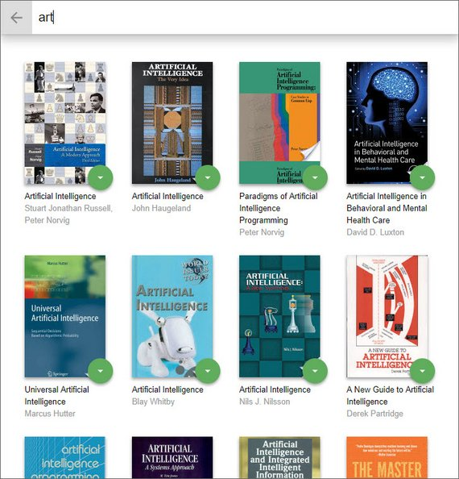](assets/images/p9.jpg)<br>
**Live Demo:** [reactnd-project-myreads@7-add-search-ajax](https://codesandbox.io/s/github/james-priest/reactnd-project-myreads/tree/7-add-search-ajax/) on CodeSandbox

## 7. Sync Books & Search
### 7.1 Refactor Props
The next piece involved getting the books from search results to reflect the same category (shelf) as my main page if any of the results contained books I've already added.

This required me to refactor some code so I could pass books from my main page along with books from the search request.

Both `myBooks` and `searchBooks` state needed to be passed to SearchBooks component.

```jsx
// App.js
class BooksApp extends Component {
  state = {
    myBooks: [],
    searchBooks: [],
  };
  // code...
  render() {
    const { myBooks, searchBooks } = this.state;
    return (
      <div className="app">
        <Route
          exact
          path="/"
          render={() => (
            <ListBooks
              bookshelves={this.bookshelves}
              books={myBooks}
              onMove={this.moveBook}
            />
          )}
        />
        <Route
          path="/search"
          render={() => (
            <SearchBooks
              searchBooks={searchBooks}
              myBooks={myBooks}
              onSearch={this.searchForBooks}
              onMove={this.moveBook}
              onResetSearch={this.resetSearch}
            />
          )}
        />
      </div>
    );
  }
}
```

Next the SearchBooks and SearchResults components are updated to pass and receive both `myBooks` and `searchBooks` as props.

```jsx
// App.js
class SearchBooks extends Component {
  render() {
    const {
      searchBooks,
      myBooks,
      onSearch,
      onResetSearch,
      onMove,
    } = this.props;
    return (
      <div className="search-books">
        <SearchBar onSearch={onSearch} onResetSearch={onResetSearch} />
        <SearchResults
          searchBooks={searchBooks}
          myBooks={myBooks}
          onMove={onMove}
        />
      </div>
    );
  }
}

const SearchResults = props => {
  const { searchBooks, myBooks, onMove } = props;
  return (
    <div className="search-books-results">
      <ol className="books-grid">
        {searchBooks.map(book => (
          <Book
            key={book.id}
            book={book}
            shelf={book.shelf ? book.shelf : 'none'}
            onMove={onMove}
          />
        ))}
      </ol>
    </div>
  );
};
```

### 7.2 Update Search Display
Next I needed to have the Search Results reflect the state of any books I've already added to my shelves. A book should read "none" if it hasn't been added.

```jsx
// App.js
const SearchResults = props => {
  const { searchBooks, myBooks, onMove } = props;
  const updatedBooks = searchBooks.map(book => {
    myBooks.map(b => {
      if (b.id === book.id) {
        book.shelf = b.shelf;
      }
      return b;
    });
    return book;
  });
  return (
    <div className="search-books-results">
      <ol className="books-grid">
        {updatedBooks.map(book => (
          <Book
            key={book.id}
            book={book}
            shelf={book.shelf ? book.shelf : 'none'}
            onMove={onMove}
          />
        ))}
      </ol>
    </div>
  );
};
```

The code maps over the books in my search results and for each book it then maps over my added books and if there's a match it sets the shelf property.

[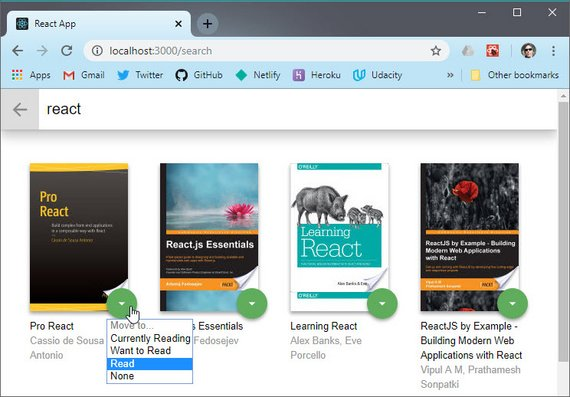](assets/images/p10.jpg)<br>
**Live Demo:** [reactnd-project-myreads@8-sync-books-and-search](https://codesandbox.io/s/github/james-priest/reactnd-project-myreads/tree/8-sync-books-and-search/) on CodeSandbox

The image shows a search result that displays books I've already added. It now shows the shelf it currently sits on.

### 7.3 Refactor Book Move
The next step is to update the bookMove method to handle books that have been added from Search and which do not have a shelf property.

```jsx
// App.js
class BooksApp extends Component {
  // code..
  moveBook = (book, shelf) => {
    // update db
    BooksAPI.update(book, shelf);

    let updatedBooks = [];
    updatedBooks = this.state.myBooks.filter(b => b.id !== book.id);

    if (shelf !== 'none') {
      book.shelf = shelf;
      updatedBooks = updatedBooks.concat(book);
    }

    this.setState({
      myBooks: updatedBooks,
    });
  };
```

This code updates the db and filters out the book from `myBooks`. Then, if a shelf other than 'none' is specified the `shelf` property is added to the book and the book is added to our state.

This shows the book displayed on our main pages on the proper shelf.

[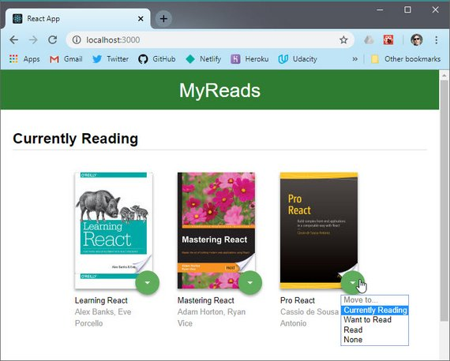](assets/images/p11.jpg)<br>
**Live Demo:** [reactnd-project-myreads@8-sync-books-and-search](https://codesandbox.io/s/github/james-priest/reactnd-project-myreads/tree/8-sync-books-and-search/) on CodeSandbox

## 8. Prep for Submission
### 8.1 Separate Components
The next step is to separate each component into its own file to promote easy reuse. Rather than one large App.js file we now have the following.

#### App.js

```jsx
import React, { Component } from 'react';
import { Route } from 'react-router-dom';
import { debounce } from 'throttle-debounce';
import * as BooksAPI from './BooksAPI';
import './App.css';
import ListBooks from './ListBooks';
import SearchBooks from './SearchBooks';

class BooksApp extends Component {
  bookshelves = [
    { key: 'currentlyReading', name: 'Currently Reading' },
    { key: 'wantToRead', name: 'Want to Read' },
    { key: 'read', name: 'Read' },
  ];
  state = {
    myBooks: [],
    searchBooks: [],
  };
  componentDidMount = () => {
    BooksAPI.getAll().then(books => {
      this.setState({ myBooks: books });
    });
  };
  moveBook = (book, shelf) => {
    BooksAPI.update(book, shelf);

    let updatedBooks = [];
    updatedBooks = this.state.myBooks.filter(b => b.id !== book.id);

    if (shelf !== 'none') {
      book.shelf = shelf;
      updatedBooks = updatedBooks.concat(book);
    }

    this.setState({
      myBooks: updatedBooks,
    });
  };
  searchForBooks = debounce(300, false, query => {
    if (query.length > 0) {
      BooksAPI.search(query).then(books => {
        if (books.error) {
          this.setState({ searchBooks: [] });
        } else {
          this.setState({ searchBooks: books });
        }
      });
    } else {
      this.setState({ searchBooks: [] });
    }
  });
  resetSearch = () => {
    this.setState({ searchBooks: [] });
  };

  render() {
    const { myBooks, searchBooks } = this.state;
    return (
      <div className="app">
        <Route
          exact
          path="/"
          render={() => (
            <ListBooks
              bookshelves={this.bookshelves}
              books={myBooks}
              onMove={this.moveBook}
            />
          )}
        />
        <Route
          path="/search"
          render={() => (
            <SearchBooks
              searchBooks={searchBooks}
              myBooks={myBooks}
              onSearch={this.searchForBooks}
              onMove={this.moveBook}
              onResetSearch={this.resetSearch}
            />
          )}
        />
      </div>
    );
  }
}

export default BooksApp;
```

#### Main Page
##### ListBooks.js

```jsx
import React, { Component } from 'react';
import Bookcase from './Bookcase';
import OpenSearchButton from './OpenSearchButton';

class ListBooks extends Component {
  render() {
    const { bookshelves, books, onMove } = this.props;
    return (
      <div className="list-books">
        <div className="list-books-title">
          <h1>MyReads</h1>
        </div>
        <Bookcase bookshelves={bookshelves} books={books} onMove={onMove} />
        <OpenSearchButton />
      </div>
    );
  }
}

export default ListBooks;
```

##### Bookcase.js

```jsx
import React from 'react';
import Bookshelf from './Bookshelf';

const Bookcase = props => {
  const { bookshelves, books, onMove } = props;
  return (
    <div className="list-books-content">
      <div>
        {bookshelves.map(shelf => (
          <Bookshelf
            key={shelf.key}
            shelf={shelf}
            books={books}
            onMove={onMove}
          />
        ))}
      </div>
    </div>
  );
};

export default Bookcase;
```

##### Bookshelf.js

```jsx
import React from 'react';
import Book from './Book';

const Bookshelf = props => {
  const { shelf, books, onMove } = props;
  const booksOnThisShelf = books.filter(book => book.shelf === shelf.key);
  return (
    <div className="bookshelf">
      <h2 className="bookshelf-title">{shelf.name}</h2>
      <div className="bookshelf-books">
        <ol className="books-grid">
          {booksOnThisShelf.map(book => (
            <Book key={book.id} book={book} shelf={shelf.key} onMove={onMove} />
          ))}
        </ol>
      </div>
    </div>
  );
};

export default Bookshelf;
```

##### Book.js

```jsx
import React from 'react';
import BookshelfChanger from './BookshelfChanger';

const Book = props => {
  const { book, shelf, onMove } = props;
  return (
    <li>
      <div className="book">
        <div className="book-top">
          <div
            className="book-cover"
            style={{
              width: 128,
              height: 193,
              backgroundImage: `url(${book.imageLinks &&
                book.imageLinks.thumbnail})`,
            }}
          />
          <BookshelfChanger book={book} shelf={shelf} onMove={onMove} />
        </div>
        <div className="book-title">{book.title}</div>
        <div className="book-authors">
          {book.authors && book.authors.join(', ')}
        </div>
      </div>
    </li>
  );
};

export default Book;
```

##### BookshelfChanger.js

```jsx
import React, { Component } from 'react';

class BookshelfChanger extends Component {
  state = {
    value: this.props.shelf,
  };
  handleChange = event => {
    this.setState({ value: event.target.value });
    this.props.onMove(this.props.book, event.target.value);
  };
  render() {
    return (
      <div className="book-shelf-changer">
        <select value={this.state.value} onChange={this.handleChange}>
          <option value="move" disabled>
            Move to...
          </option>
          <option value="currentlyReading">Currently Reading</option>
          <option value="wantToRead">Want to Read</option>
          <option value="read">Read</option>
          <option value="none">None</option>
        </select>
      </div>
    );
  }
}

export default BookshelfChanger;
```

#### Search Page
##### SearchBooks.js

```jsx
import React, { Component } from 'react';
import SearchResults from './SearchResults';
import SearchBar from './SearchBar';

class SearchBooks extends Component {
  render() {
    const {
      searchBooks,
      myBooks,
      onSearch,
      onResetSearch,
      onMove,
    } = this.props;
    return (
      <div className="search-books">
        <SearchBar onSearch={onSearch} onResetSearch={onResetSearch} />
        <SearchResults
          searchBooks={searchBooks}
          myBooks={myBooks}
          onMove={onMove}
        />
      </div>
    );
  }
}

export default SearchBooks;
```

##### CloseSearchButton.js

```jsx
import React from 'react';
import { Link } from 'react-router-dom';

const CloseSearchButton = props => {
  const { onResetSearch } = props;
  return (
    <Link to="/">
      <button className="close-search" onClick={onResetSearch}>
        Close
      </button>
    </Link>
  );
};

export default CloseSearchButton;
```

##### SearchBooksInput.js

```jsx
import React, { Component } from 'react';

class SearchBooksInput extends Component {
  state = {
    value: '',
  };
  handleChange = event => {
    const val = event.target.value;
    this.setState({ value: val }, () => {
      this.props.onSearch(val);
    });
  };
  render() {
    return (
      <div className="search-books-input-wrapper">
        <input
          type="text"
          value={this.state.value}
          placeholder="Search by title or author"
          onChange={this.handleChange}
          autoFocus
        />
      </div>
    );
  }
}

export default SearchBooksInput;
```

##### SearchResults.js

```jsx
import React from 'react';
import Book from './Book';

const SearchResults = props => {
  const { searchBooks, myBooks, onMove } = props;

  const updatedBooks = searchBooks.map(book => {
    myBooks.map(b => {
      if (b.id === book.id) {
        book.shelf = b.shelf;
      }
      return b;
    });
    return book;
  });
  return (
    <div className="search-books-results">
      <ol className="books-grid">
        {updatedBooks.map(book => (
          <Book
            key={book.id}
            book={book}
            shelf={book.shelf ? book.shelf : 'none'}
            onMove={onMove}
          />
        ))}
      </ol>
    </div>
  );
};

export default SearchResults;
```



Some of these components could have been left in their parent component files e.g. OpenSearchButton, CloseSearchButton, etc. but I separated everything out nonetheless.

Here's Main page.

[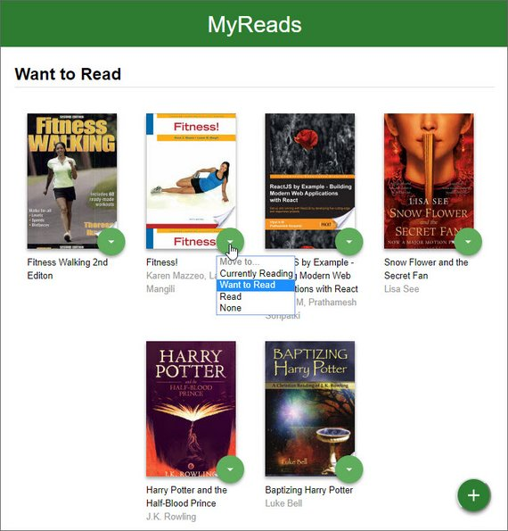](assets/images/p12.jpg)<br>
**Live Demo:** [reactnd-project-myreads@9-separate-components](https://codesandbox.io/s/github/james-priest/reactnd-project-myreads/tree/9-separate-components/) on CodeSandbox

Here is the Search page.

[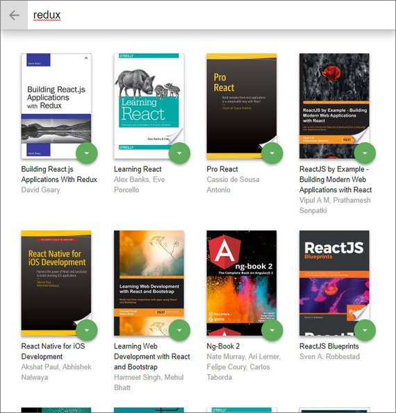](assets/images/p13.jpg)<br>
**Live Demo:** [reactnd-project-myreads@9-separate-components](https://codesandbox.io/s/github/james-priest/reactnd-project-myreads/tree/9-separate-components/) on CodeSandbox

### 8.2 Submit Project
The last step was to push everything to GitHub and make sure the README instructions were up to date and clearly specified how to install and run the project.

> If you chose to develop on your local machine (by either starting with the starter project or starting from scratch with Create React App), you will need to:
>
> - Push your project to GitHub, making sure to push the master branch.
> - On the project submission page choose the option "Submit with GitHub"
> - Select the repository for this project (you may need to connect your GitHub account first).

## 9. Feedback & Response
### 9.1 Project Review
Here's the response I received.

> #### Meets Specifications
> Congratulations on completing MyReads on your first attempt.
>
> The detailed process walkthrough is a great addition to the project; be sure to include the link when presenting the portfolio.
>
>If you're interested to take it up a notch, you can provide test coverage to components with Jest. Get started here:
> - [Jest: Testing React Apps Tutorial](https://jestjs.io/docs/en/tutorial-react)
>
> Keep up the good work and have fun with your coming projects.

> #### Application Setup
> The README is detailed and and the process walkthrough is invaluable. Here are some suggestions for the process walkthrough:
>
> - break the process down into stages ( i.e. architecture planning, => UI components => logic => refactoring ). This write-up should be written with minimal mention of tools to explain your thought process which is invaluable in an interview,
> - explain your understanding of data mutability/immutability and state management
> - testing (try not to ignore this aspect before heading into an interview),
>
Here's a handy README template for future projects:
> - [GitHub gist: README template](https://gist.github.com/PurpleBooth/109311bb0361f32d87a2)
>
> All things said, good work 💯

> #### Main Page
> BEST PRACTICE:
> Try not to break the application down into too many moving parts.
>
> A rationale is given and explained in the Code Review section.

> #### Search Page
> Search was well implemented and bug-free 💯

> #### Code Functionality
> ##### Component State
> Tip ⚡
>
> Assigning array and/or objects to new variables creates shallow copies and might cause 'illegal' updates to state.
>
> Explanation in **Code Review > App.js**.
>
> ##### Error Handling
> BEST PRACTICE:
> When writing asynchronous code, it's a good idea to include error handling.
>
> Examples can be found in the Code Review section.

### 9.2 Code Review
Here's breakdown of the comments related to each file.

#### App.js

```jsx
import { Route } from 'react-router-dom';
import { debounce } from 'throttle-debounce';
import * as BooksAPI from './BooksAPI';
import './App.css';
// import getAll from './data';
import ListBooks from './ListBooks';
import SearchBooks from './SearchBooks';

class BooksApp extends Component {
  bookshelves = [
    { key: 'currentlyReading', name: 'Currently Reading' },
    { key: 'wantToRead', name: 'Want to Read' },
    { key: 'read', name: 'Read' },
  ];
```

BEST PRACTICE:

Try not to pollute the scope of `this` with variables, especially if those variables are constants. These can be moved out of the components scope or into a separate file.

```jsx
  state = {
    myBooks: [],
    searchBooks: [],
  };
  componentDidMount = () => {
    BooksAPI.getAll().then(books => {
      this.setState({ myBooks: books });
    });
  };
```

BEST PRACTICE:

It's good practice to `catch` potential errors from a remote server. Many things might go wrong:

- user's device offline in subway,
- shark ate intercontinental cable,
- server temporarily offline,
- slow connection,

An error key can be created in the `state` object for this purpose.

```jsx
  moveBook = (book, shelf) => {
    BooksAPI.update(book, shelf);

    let updatedBooks = [];
    updatedBooks = this.state.myBooks.filter(b => b.id !== book.id);
    if (shelf !== 'none') {
      book.shelf = shelf;
      updatedBooks = updatedBooks.concat(book);
    }

    this.setState({
      myBooks: updatedBooks,
    });
  };
```

A few factors to note about `updateBooks` assignment.

1. `Array.prototype.filter` creates/returns a new array after running the filtering function but it only provides a shallow copy - meaning nested objects are still passed by ref. Read about this method here:
   - [Array.prototype.filter()](https://developer.mozilla.org/en-US/docs/Web/JavaScript/Reference/Global_Objects/Array/filter) on MDN
2. The update pattern above is not encouraged, as reassigning arrays and objects creates shallow copies of the original (specific to JavaScript language only).
- editing shallow copies will edit the **original**, which means state might be illegally/accidentally updated without calling `this.setState`.
  
Read more about shallow vs deep copies:
- [Understanding Deep and Shallow Copy in Javascript](https://we-are.bookmyshow.com/understanding-deep-and-shallow-copy-in-javascript-13438bad941c).
- [How to differentiate between deep and shallow copies in JavaScript](https://medium.freecodecamp.org/copying-stuff-in-javascript-how-to-differentiate-between-deep-and-shallow-copies-b6d8c1ef09cd)

Read about using previous state in `this.setState` here:
- [https://reactjs.org/docs/react-component.html#setstate](https://reactjs.org/docs/react-component.html#setstate)

#### Book.js

```jsx
import React from 'react';
import BookshelfChanger from './BookshelfChanger';

const Book = props => {
  const { book, shelf, onMove } = props;
```

Tip ⚡

The `props` object received from this component's parent can be destructured as parameters for a stateless component.

```jsx
  return (
    <li>
      <div className="book">
        <div className="book-top">
          <div
            className="book-cover"
            style={{
              width: 128,
              height: 193,
              backgroundImage: `url(${book.imageLinks &&
                book.imageLinks.thumbnail})`,
```

BEST PRACTICE:

Display placeholders to improve the user's experience when the server returns incomplete data.

```jsx
            }}
          />
          <BookshelfChanger book={book} shelf={shelf} onMove={onMove} />
        </div>
        <div className="book-title">{book.title}</div>
        <div className="book-authors">
          {book.authors && book.authors.join(', ')}
```

BEST PRACTICE:

Use the 'short-circuit' pattern with care. When building user-centric UI you'd still want to return something instead of `null` or `undefined`.

See alternative in code example above.

#### BookshelfChanger.js

```jsx
import React, { Component } from 'react';

class BookshelfChanger extends Component {
  state = {
    value: this.props.shelf,
  };
  handleChange = event => {
    this.setState({ value: event.target.value });
    this.props.onMove(this.props.book, event.target.value);
  };
```

Tip ⚡

Destructure `event` and assign it's value to `this.state.value` with the shorthand method.

- [Object Initializer - JavaScript \| MDN](https://developer.mozilla.org/en-US/docs/Web/JavaScript/Reference/Operators/Object_initializer)
- [Method definitions - JavaScript \| MDN](https://developer.mozilla.org/en-US/docs/Web/JavaScript/Reference/Functions/Method_definitions)

```jsx
  render() {
    // console.log(this.props.shelf);
```

BEST PRACTICE:

It's a good idea to remove logging statements before presenting the code in your portfolio.

Additionally, breakpoints are efficient compared to `console.log`:

- [How To Pause Your Code With Breakpoints In Chrome DevTools](https://developers.google.com/web/tools/chrome-devtools/javascript/breakpoints)
- [Please stop using console.log(), it’s broken...](https://hackernoon.com/please-stop-using-console-log-its-broken-b5d7d396cf15) - Hacker Noon

#### CloseSearchButton.js

```jsx
import React from 'react';
import { Link } from 'react-router-dom';

const CloseSearchButton = props => {
```

BEST PRACTICE:

There are no written rules on the size of a component before it should be separated into its own file. However, a few considerations apply to keep code base maintenance sane.

**Don't put code in it's own file/component if:**

- its length is a few lines and called only a few times from other components,
- props need to be passed multiple levels to reach the component,
- creating it causes future maintenance to be a headache due to component saturation
  
EXPLANATION:

In the production environment the code base will last years until it becomes 'legacy code'. Maintenance, optimizations and updates are performed by the team on a daily basis.

A separate component for each UI element will only get you a meeting with HR.

### 9.3 Implement Changes
Here's a summary of the changes and requirements based on the code review.

App.js

1. Move constants out of component and place in global scope.
2. Catch all possible errors coming back from Ajax requests.
   - Create `error` key in state to trigger message in UI.
3. Fix Array reassign of state due to shallow copy that occurs with reassignment of array in JavaScript.
   - Always handle alternative `else` statements.

Book.js

1. Destructure props as parameters for a stateless component.
2. Use placeholder image on incomplete data.
3. Use short-circuit pattern with care in UI. You want to return something rather than `null` or `undefined`.

BookshelfChanger.js

1. Destructure `event` with shorthand method.
2. Remove log statements.

#### App.js
1. Move constants out of component and place in global scope.
2. Catch all possible errors coming back from Ajax requests.
   - Create `error` key in state to trigger message in UI.
3. Fix Array reassign of state due to shallow copy that occurs with reassignment of array in JavaScript.
   - Always handle alternative `else` statements.

##### 1. Before

```jsx
class BooksApp extends Component {
  bookshelves = [
    { key: 'currentlyReading', name: 'Currently Reading' },
    { key: 'wantToRead', name: 'Want to Read' },
    { key: 'read', name: 'Read' },
  ];
```

##### 1. After

```jsx
bookshelves = [
  { key: 'currentlyReading', name: 'Currently Reading' },
  { key: 'wantToRead', name: 'Want to Read' },
  { key: 'read', name: 'Read' },
];
class BooksApp extends Component {
```

##### 2. Before

```jsx
  state = {
    myBooks: [],
    searchBooks: [],
  };
  componentDidMount = () => {
    BooksAPI.getAll().then(books => {
      this.setState({ myBooks: books });
    });
  };
  render() {
    const { myBooks, searchBooks, error } = this.state;
    return (
      // ui code...
    )
  }
```

##### 2. After

```jsx
  state = {
    myBooks: [],
    searchBooks: [],
    error: false
  };
  componentDidMount = () => {
    BooksAPI.getAll()
      .then(books => {
        this.setState({ myBooks: books });
      })
      .catch(err => {
        console.log(err);
        this.setState({ error: true });
      });
  };
  render() {
    const { myBooks, searchBooks, error } = this.state;
    if (error) {
      return <div>Network error. Please try again later.</div>;
    }
    return (
      // ui code...
    )
  }
}
```

##### 3. Before

```jsx
  moveBook = (book, shelf) => {
    BooksAPI.update(book, shelf);

    let updatedBooks = [];
    updatedBooks = this.state.myBooks.filter(b => b.id !== book.id);
    if (shelf !== 'none') {
      book.shelf = shelf;
      updatedBooks = updatedBooks.concat(book);
    }

    this.setState({
      myBooks: updatedBooks,
    });
  };
```

##### 3. After

```jsx
  moveBook = (book, shelf) => {
    BooksAPI.update(book, shelf).catch(err => {
      console.log(err);
      this.setState({ error: true });
    });
    if (shelf === 'none') {
      this.setState(prevState => ({
        myBooks: prevState.myBooks.filter(b => b.id !== book.id)
      }));
    } else {
      book.shelf = shelf;
      this.setState(prevState => ({
        myBooks: prevState.myBooks.filter(b => b.id !== book.id).concat(book)
      }));
    }
  };
```

#### Book.js

1. Destructure props as parameters for a stateless component.
2. Use placeholder image on incomplete data.
3. Use short-circuit pattern with care in UI. You want to return something rather than `null` or `undefined`.

##### 1. Before

```jsx
import React from 'react';
import BookshelfChanger from './BookshelfChanger';

const Book = props => {
  const { book, shelf, onMove } = props;
  return (
    <li>{/* UI code */}</li>
  );
};
```

##### 1. After

```jsx
import React from 'react';
import BookshelfChanger from './BookshelfChanger';

const Book = ({ book, shelf, onMove }) => (
  <li>{/* UI code */}</li>
);
```

##### 2. Before

```jsx
  return (
    <li>
      <div className="book">
        <div className="book-top">
          <div
            className="book-cover"
            style={{
              width: 128,
              height: 193,
              backgroundImage: `url(${book.imageLinks &&
                book.imageLinks.thumbnail})`,
```

##### 2. After

```jsx
  <li>
    <div className="book">
      <div className="book-top">
        <div
          className="book-cover"
          style={{
            width: 128,
            height: 193,
            backgroundImage: `url(${
              book.imageLinks
                ? book.imageLinks.thumbnail
                : 'icons/book-placeholder.svg'
            })`
```

##### 3. Before

```jsx
     <div className="book-authors">
       {book.authors && book.authors.join(', ')}
```

##### 3. After

```jsx
      <div className="book-authors">
        {book.authors ? book.authors.join(', ') : 'Unknown Author'}
```

#### BookshelfChanger.js

1. Destructure `event` with shorthand method.
2. Remove log statements.

##### 1. Before

```jsx
import React, { Component } from 'react';

class BookshelfChanger extends Component {
  state = {
    value: this.props.shelf,
  };
  handleChange = event => {
    this.setState({ value: event.target.value });
    this.props.onMove(this.props.book, event.target.value);
  };
```

##### 1. After

```jsx
import React, { Component } from 'react';

class BookshelfChanger extends Component {
  state = {
    value: this.props.shelf,
  };
  handleChange = event => {
    const { value } = event.target;
    this.setState({ value });
    this.props.onMove(this.props.book, value);
  };
```

### 9.4 Simplify Structure
The last piece is to consolidate components based on the following recommendations.

> **Don't put code in it's own file/component if:**
>
> - its length is a few lines and called only a few times from other components,
> - props need to be passed multiple levels to reach the component,
> - creating it causes future maintenance to be a headache due to component saturation

Given this instruction I decided to follow this new, simplified hierarchy.

- BooksApp
  - Route {ListBooks}
    - Bookshelf
      - Book
        - BookshelfChanger
  - Route {SearchBooks}
    - SearchBooksInput
    - SearchResults
      - Book
        - BookshelfChanger

Here's the screenshot of the UI which hasn't changed but the underlying structure has.

[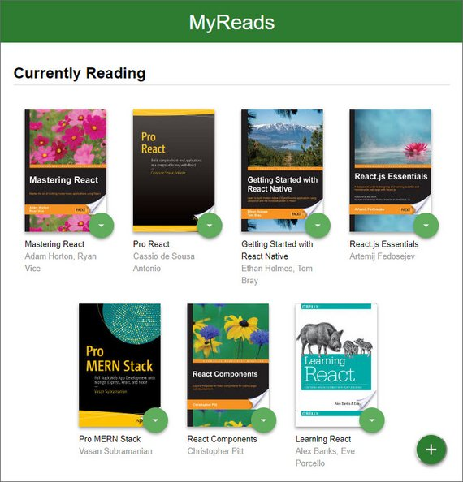](assets/images/p14.jpg)<br>
**Live Demo:** [reactnd-project-myreads@10-code-review-enhancements](https://codesandbox.io/s/github/james-priest/reactnd-project-myreads/tree/10-code-review-enhancements/) on CodeSandbox
